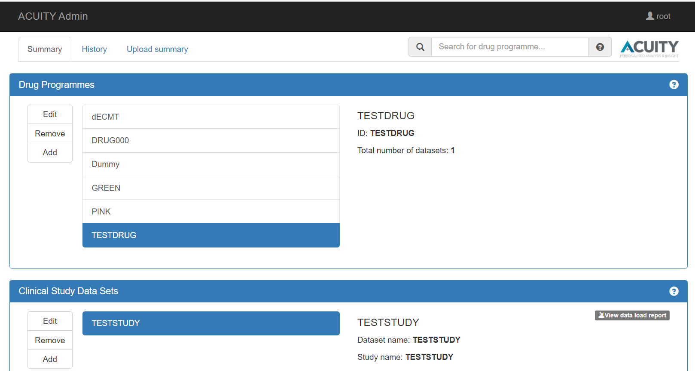

[](https://github.com/digital-ECMT/acuity-admin/actions/workflows/build-artifacts-and-image.yml)
[](https://opensource.org/licenses/Apache-2.0)

### ACUITY AdminUI  

ACUITY is a digital solution to revolutionize the way we can interpret and analyze data from clinical trials. 
It will facilitate data interpretation through an interactive visual platform designed to effortlessly enable access across a drug program and individual studies, down to individual patient level data.  

System includes several applications:  
* <a href='https://github.com/digital-ECMT/vahub'>VA-Hub</a> - a web application showing the clinical trials data visualizations
* AdminUI - a web application to load clinical studies data into the ACUITY
* <a href='https://github.com/digital-ECMT/va-security'>VA-Security</a> – a web application providing authentication/authorization settings for the system

Check <a href='https://github.com/digital-ECMT/acuity-docker/wiki'> ACUITY Visualisations Wiki </a> for more information.
<b> To set up applications please refer to instructions in the [following repository](https://github.com/digital-ECMT/acuity-docker).
</b>
<hr>

## Developer's section
### AdminUI Installation

  

These instructions will help you run a copy of the AdminUI project on your local machine for development and testing purposes.  

### Prerequisites

* Java SE Development Kit >=1.8
* Maven 3.5.4

1. [Set up database](https://github.com/digital-ECMT/acuity-docker/wiki) to be used in ACUITY applications.
   Prefer [deployments scripts](https://github.com/digital-ECMT/acuity-deployment-scripts) for that purposes.
   If you've already done this during installation of other ACUITY applications, skip this step.

2. Set up database connection settings in a Spring profile file `application-<envSpecificProfile>.yml` located in `/local-configs` directory (See [ACUITY Database Setup](https://github.com/digital-ECMT/acuity-docker/wiki/Applications-Spring-Configs)).

3. <a href='https://github.com/digital-ECMT/va-security'>Install all VA-Security artifacts</a> to the local repository.  
    (if you've already done this during installation of other ACUITY applications, skip this step)

4. In a command-line tool run Maven `clean` and `install` tasks from the application root directory:

    ```
    mvn clean install
    ```

    or run these Maven tasks in IntelliJ IDEA.

5. AdminUI can be run in two modes:
    * perform authentication/authorization checks configured in VA-Security application
    * skip VA-Security checks and provide full permissions to the user 

    When running backend with VA-Security checks, user can see drug programmes/studies/datasets and perform actions only if he/she was explicitly authorized for it in VA-Security application. This mode can be useful when application integration with VA-Security component matters.  

    Without VA-Security checks user can see all drug programmes/studies/datasets available in the system and can perform any operation on them. This mode can be convenient when developing and testing features not related to VA-Security. 
    
    To start AdminUI with VA-Security checks run from `/acuity-core` directory:
    ```
    mvn spring-boot:run -Dspring.profiles.active=<envSpecificProfile>,local-auth,azure-storage -Dspring.config.location=./../local-configs/ -Dspring.cloud.config.uri=http://localhost:8080/config -Dserver.port=9090
    ```

    To start AdminUI without VA-Security checks run from `/acuity-core` directory:
    ```
    mvn spring-boot:run -Dspring.profiles.active=<envSpecificProfile>,local-no-security,azure-storage -Dspring.config.location=./../local-configs/ -Dserver.port=9090
    ```

    where
    * `<envSpecificProfile>` is a name of Spring profile for specific environment (`dev`, `test`) located in `/local-configs` directory
    * `http://localhost:8080/config` - URL of running VA-Security application

6. When you'll see a big ASCII-art text "ADMINUI HAS STARTED" in the console, open AdminUI app at http://localhost:9090/

## Usage
Check <a href='https://github.com/digital-ECMT/acuity-docker/wiki'>ACUITY Visualisations Wiki</a> for user manuals.

## Contributing
See [Contributing Guide](/docs/contributing.md).

## License
Licensed under the [Apache 2.0](http://www.apache.org/licenses/LICENSE-2.0) license.
